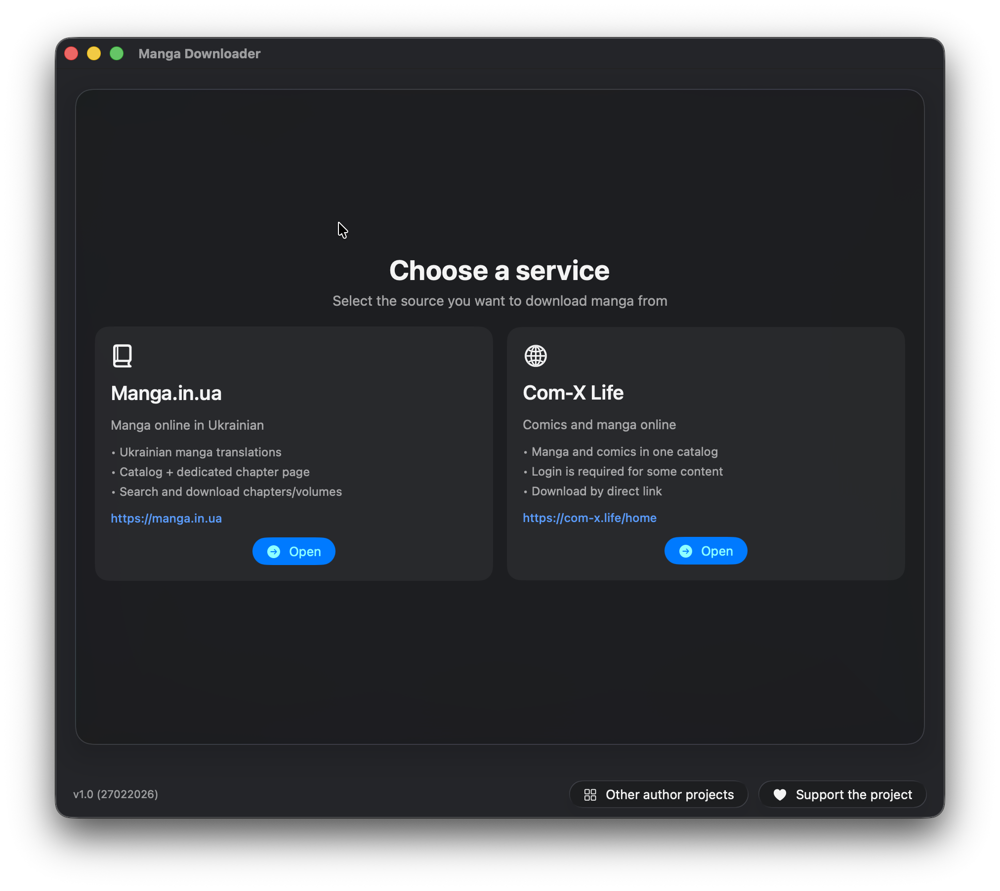

# Manga Downloader (macOS)

Manga Downloader is a friendly macOS app that helps you download manga from supported websites and convert it into EPUB files optimized for e-ink reading.
Common search phrases: `manga downloader macOS`, `EPUB manga converter`, `manga.in.ua downloader`, `com-x.life downloader`.

Supported services:
- `manga/in/ua` (`manga.in.ua`)
- `com-x.life` (`com-x.life`)

Interface languages:
- Ukrainian
- English
- Russian

## Documentation

GitHub Pages:
- Main: https://slabkin-alexey.github.io/manga-downloader-macos/
- English: https://slabkin-alexey.github.io/manga-downloader-macos/en/
- Ukrainian: https://slabkin-alexey.github.io/manga-downloader-macos/uk/
- Russian: https://slabkin-alexey.github.io/manga-downloader-macos/ru/

## Screenshots

1. Downloader screen (ready state)



2. Service selection screen


3. Active download with progress and logs


## What You Can Do

- Choose one of two sources (`manga/in/ua`, `com-x.life`)
- Paste one URL or a queue of URLs
- Use `manga/in/ua` search mode or URL download mode
- Filter chapters/volumes with range syntax (`1-2,4,10-12`)
- Add an optional custom EPUB cover image
- Run full pipeline: download -> grayscale -> e-ink resize -> HEIC -> CBZ -> EPUB
- Get one EPUB output per volume
- Use `com-x.life` auth flow (in-app WebView login, cookie persistence, retry, reset login)
- Track work with localized logs, clickable links, and multi-level progress bars
- Start/Stop with cancellation and cleanup
- Enable Turbo mode for higher performance (with warning and saved state)
- Receive completion alert + macOS notification

## Quick Start

1. Open the app and choose a source service.
2. Enter URL(s), or enter search text (`manga/in/ua` only).
3. Optionally set chapter/volume filters and cover image.
4. Click Start.
5. For each chapter/page set, the app runs:
   - download original image/archive
   - grayscale conversion (B/W)
   - e-ink resize (max 1080px height, no upscaling)
   - HEIC conversion
   - metadata cleanup where possible
   - packaging to CBZ and EPUB (per volume)

## Release Assets (1.1)

Latest 1.1 release page:
- https://github.com/slabkin-alexey/manga-downloader-macos/releases/tag/1.1

Assets:
- `Manga-Downloader-macOS-1.1.zip`
- `RELEASE_NOTES_1.1.md`
- `SHA256SUMS.txt`

Verify integrity:

```bash
shasum -a 256 -c SHA256SUMS.txt
```

## FAQ / Troubleshooting

- Input is rejected: check URL list format and required fields.
- Filter errors: use only numbers and ranges separated by commas.
- `com-x.life` asks for authorization: complete login in WebView or reset saved cookies.
- Conversion is slow/low quality: install `magick` (ImageMagick) for preferred conversion path.
- CPU load/temperature is high: disable Turbo mode.

## Questions and Suggestions

If you have questions or suggestions, we are happy to hear from you:
- borunov.alexey.work@gmail.com

## Privacy and Legal

- The app processes URLs/content provided by the user.
- `com-x.life` auth cookies are stored for authenticated retry flow and can be reset by user action.
- Users are responsible for compliance with website terms and applicable copyright laws.
