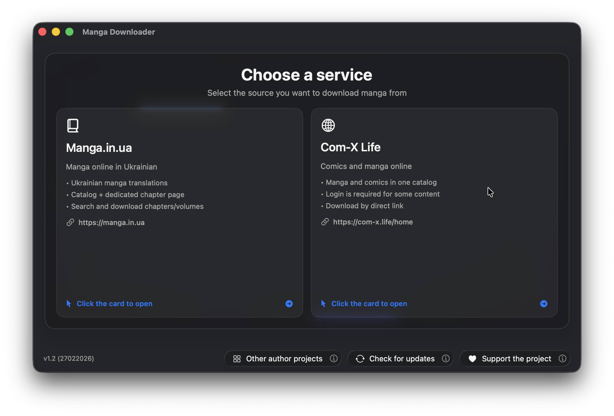
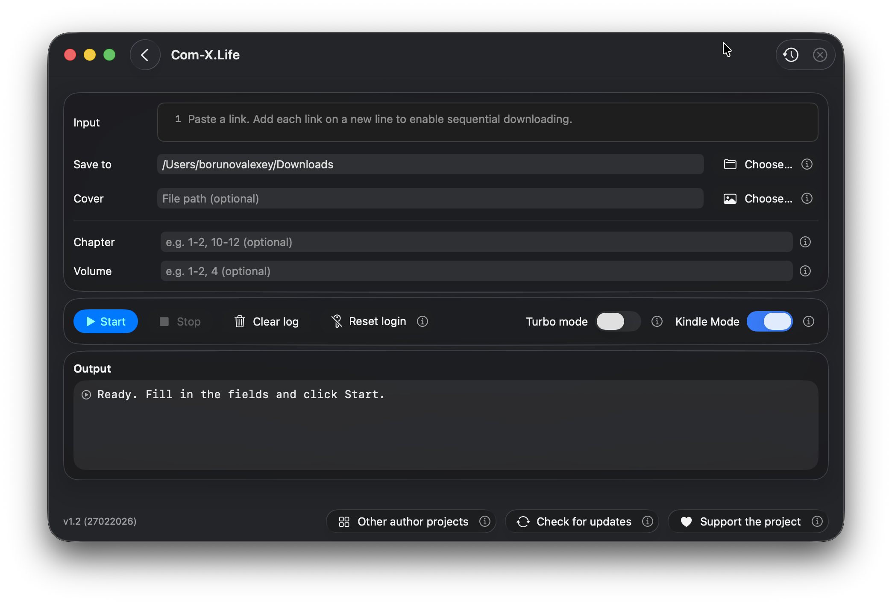
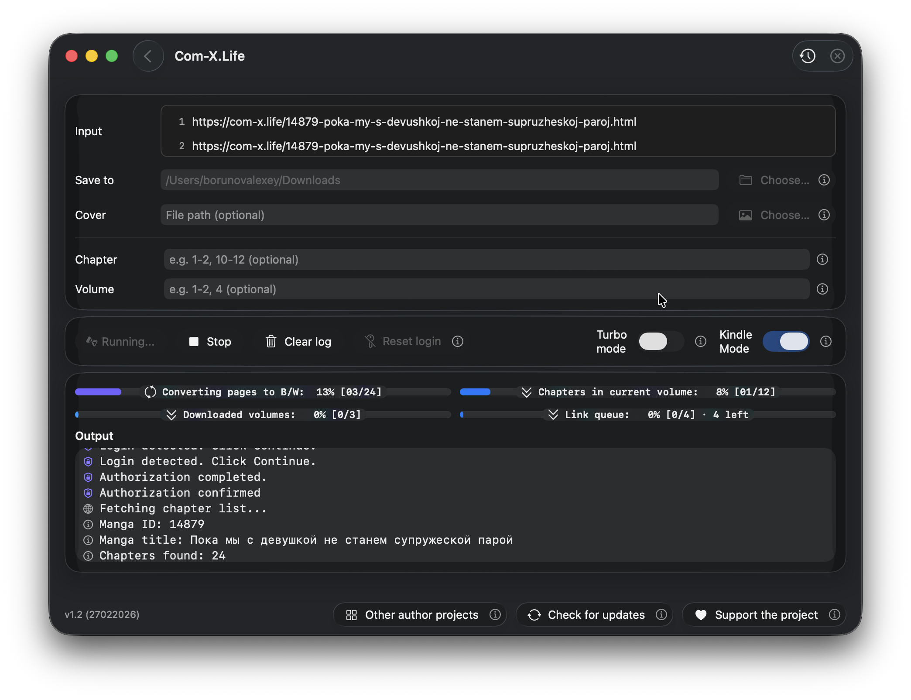

# Manga Downloader (macOS)

Manga Downloader - це зручний застосунок для macOS, який допомагає завантажувати мангу з підтримуваних сайтів і конвертувати її у EPUB, оптимізований для e-ink читання.
Пошукові фрази: `manga downloader macOS`, `EPUB manga converter`, `manga.in.ua downloader`, `com-x.life downloader`.

Підтримувані сервіси:
- `manga/in/ua` (`manga.in.ua`)
- `com-x.life` (`com-x.life`)

Мови інтерфейсу:
- Українська
- English
- Русский

## Документація

GitHub Pages:
- Main: https://slabkin-alexey.github.io/manga-downloader-macos/
- English: https://slabkin-alexey.github.io/manga-downloader-macos/en/
- Ukrainian: https://slabkin-alexey.github.io/manga-downloader-macos/uk/
- Russian: https://slabkin-alexey.github.io/manga-downloader-macos/ru/

## Скріншоти

1. Екран вибору сервісу



2. Інтерфейс відкритого обраного сервісу



3. Активна робота обраного сервісу



## Що вміє застосунок

- Вибір одного з двох джерел (`manga/in/ua`, `com-x.life`)
- Ввід одного URL або черги URL
- Режим пошуку `manga/in/ua` і режим завантаження за URL
- Фільтрація розділів/томів синтаксисом діапазонів (`1-2,4,10-12`)
- Опціональна власна обкладинка EPUB
- Повний pipeline: download -> grayscale -> e-ink resize -> HEIC -> CBZ -> EPUB
- Окремий EPUB для кожного тому
- Auth-потік `com-x.life` (in-app WebView login, cookies, retry, reset login)
- Локалізовані логи, клікабельні посилання і багаторівневий прогрес
- Start/Stop з коректним скасуванням і очищенням
- Turbo-режим для вищої продуктивності (з попередженням)
- Повідомлення про завершення в застосунку і в macOS

## Швидкий старт

1. Запустіть застосунок і виберіть сервіс.
2. Вставте URL(и) або введіть текст для пошуку (`manga/in/ua`).
3. За потреби задайте фільтри розділів/томів і обкладинку.
4. Натисніть Start.
5. Для кожного набору сторінок виконується:
   - download original image/archive
   - grayscale conversion (B/W)
   - e-ink resize (max 1080px height, no upscaling)
   - HEIC conversion
   - metadata cleanup where possible
   - packaging to CBZ and EPUB (per volume)

## Release Assets (2.0.1)

Сторінка релізу 2.0.1:
- https://github.com/slabkin-alexey/manga-downloader-macos/releases/tag/2.0.1

Файли:
- `Manga-Downloader-macOS-2.0.1.zip`
- `RELEASE_NOTES_2.0.1.md`
- `SHA256SUMS.txt`

Перевірка цілісності:

```bash
shasum -a 256 -c SHA256SUMS.txt
```

## FAQ / Вирішення проблем

- Ввід відхиляється: перевірте формат URL і обов’язкові поля.
- Помилки фільтра: використовуйте лише числа і діапазони через кому.
- `com-x.life` просить авторизацію: увійдіть у WebView або скиньте cookies.
- Конвертація повільна/неякісна: встановіть `magick` (ImageMagick).
- Високе навантаження CPU/температура: вимкніть Turbo-режим.

## Питання та пропозиції

Якщо маєте питання або пропозиції, напишіть нам:
- borunov.alexey.work@gmail.com

## Конфіденційність і юридична інформація

- Застосунок обробляє URL/контент, надані користувачем.
- Cookies `com-x.life` зберігаються для авторизованого retry-потоку і можуть бути скинуті користувачем.
- Користувач несе відповідальність за дотримання умов сервісів і чинного авторського права.
